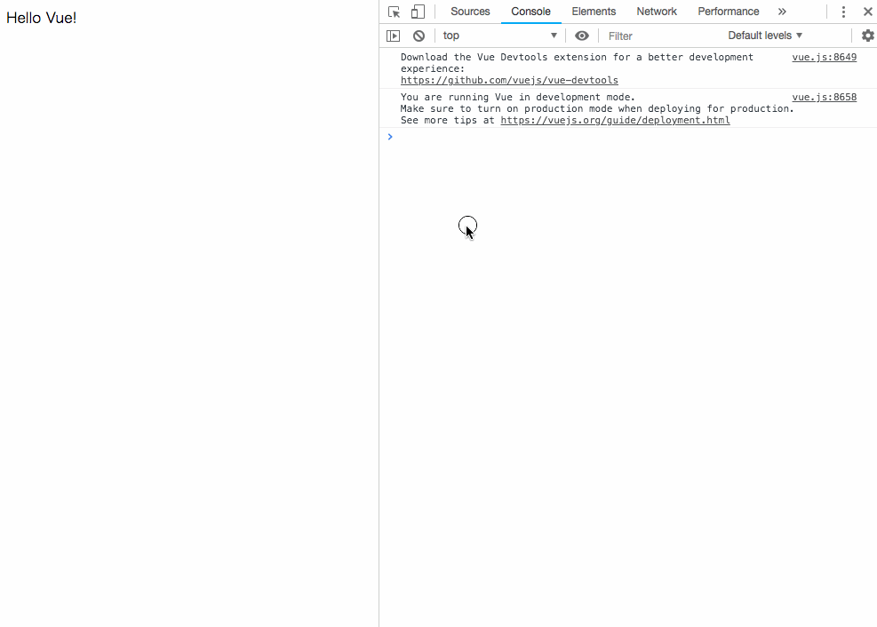

[[toc]]

# ハンズオン

基本的には以下のページをなぞって、Vueのコア機能を理解するようにします。

[はじめに — Vue\.js](https://jp.vuejs.org/v2/guide/index.html)

理解を深めたい場合、公式リファレンスを繰り返し読みましょう。基本的には日本語訳されているので読みやすいはずです。

## 宣言的レンダリング

Vue.js のコアは、単純なテンプレート構文を使って宣言的にデータを DOM に描画することを可能にするシステムです。

```html
<div id="app">
  {{ message }}
</div>
```

```js
// Vueインスタンスを作成して、id=appに紐付ける
var app = new Vue({
  el: '#app',
  data: {
    message: 'Hello Vue!'
  }
})
```

一見するとただテンプレートを描画しているだけですが、Vue.js は内部で多くの作業を行っています。データと DOM は関連付けられ、そして全てが **リアクティブ** になっています。

### リアクティブを体感する その1

ためしに、ブラウザのコンソールから `app.message` の値を変えてみましょう。

```js
// ブラウザのコンソール上で実行する
app.message = "Hello JSL!"
```

描画されたサンプルが、 `Hello JSL!` に変わったのが確認できると思います。

Vueインスタンスに渡された `data` プロパティはすべてがリアクティブな値になります。dataプロパティには `instanceName.propertyName` でアクセス可能です。
また、インスタンス内部では `this.propertyName` でアクセス可能です。 `this` はインスタンス内部のスコープを表します。
Vueインスタンス内のdataの変化は、意識することなくDOM上に展開しているデータと連動して変化します。



### リアクティブを体感する その2

文字列の展開に加えて、以下のように要素の属性もリアクティブにすることができます。

例として、 `title` 属性をリアクティブにしてみます。

```html
<div id="app-2">
  <span v-bind:title="message">
      マウスオーバーして数秒後に、この要素のタイトルが出現します。
  </span>
</div>
```

```js
var app2 = new Vue({
  el: '#app-2',
  data: {
    message: 'あなたがページを更新した時刻は' + new Date().toLocaleString()
  }
})
```

`v-bind` 属性はDOMに対して、リアクティブな振る舞いを提供します。
上記の例は、「この要素の `title` 属性を `Vue` インスタンスの `message` プロパティによって更新して保存する」ということになります。

また、Vuejsの提供する `v-` の接頭辞のついたプロパティを **ディレクティブ** といいます。

### リアクティブを体感する その3

htmlの `<input>` タグのvalue属性をリアクティブなふるまいにしてみましょう。

```html
<div id="app-2">
  <input v-bind:title="message">
</div>
```


::: tip

#### なぜリアクティブであることが重要なのか？

多くのバックエンドフレームワークで MVC(もしくはMTV) アーキテクチャを採用しているように、多くのフロントエンドフレームワークでは MVVM アーキテクチャを採用しています。

これは Model View ViewModel の略で、Model(ビジネスロジック)とView(ユーザに対して見える部分)を分離し、制約をつけることで見通しの良いコードを書くためのアーキテクチャです。

また、ViewとModelをつなぎこむ部分をViewModelと呼び、ViewとViewModelのデータがリアクティブに変化することで実現します。

Vuejsにおいて、`View = Vueインスタンスを紐付けるDOM` 、 `ViewModel = Vueインスタンス` のように解釈することが出来ます。

実はVue本体はModelを提供しておらず、VuexなどのプラグインやStoreパターンを使う場合のみModelを分離可能だと考えています。

[Vuex とは何か？ \| Vuex](https://vuex.vuejs.org/ja/)

[状態管理 — Vue\.js](https://jp.vuejs.org/v2/guide/state-management.html#%E3%82%B7%E3%83%B3%E3%83%97%E3%83%AB%E3%81%AA%E7%8A%B6%E6%85%8B%E7%AE%A1%E7%90%86%E3%82%92%E3%82%BC%E3%83%AD%E3%81%8B%E3%82%89%E4%BD%9C%E3%82%8B)
:::

## イベントを購読する


--- 

VuejsでDOMのイベントを購読するには `v-on` ディレクティブを使います。


```html
<div id="app-2">
  <button v-on:click='popAlert'>
    アラートを出す
  </button>
</div>
```

```js
var app2 = new Vue({
  el: '#app-2',
  data: {
    alertMessage: 'ボタンが押されました'
  },
  methods: {
    popAlert: function() {
      alert(this.alertMessage);
    },
  }
})
```

ここではbutton要素のclickイベントを購読しています。

Vueインスタンスに見慣れないプロパティがあることに気づいたかもしれません。

`methods` プロパティは、Vueインスタンス内部や、インスタンスが紐付いたDOMからアクセスできる関数です。

clickイベントが発火すると、Vueインスタンスに定義された、 `popAlert` という関数が呼び出されます。

methodsに定義した関数は、上記の例のようにディレクティブ内で使用することが可能です。

また、dataプロパティと同様に、テンプレート構文やインスタンス内部から呼び出すことも可能です。

::: tip
フロントエンド開発では、画面上でのユーザからの入力や変更をイベントして受け取り、それぞれのイベントに対し、動作を規定しておくことがしばしばあります。

これはバックエンド開発ではあまり考えたことのない概念かもしれません。

e.g. ボタンをクリックすることでダイアログが開く等

一般的に **イベントを購読する** 、 **イベントが発火する** のように使われます。
:::

## 条件分岐

## ループ

